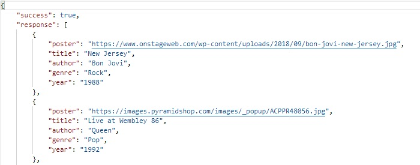
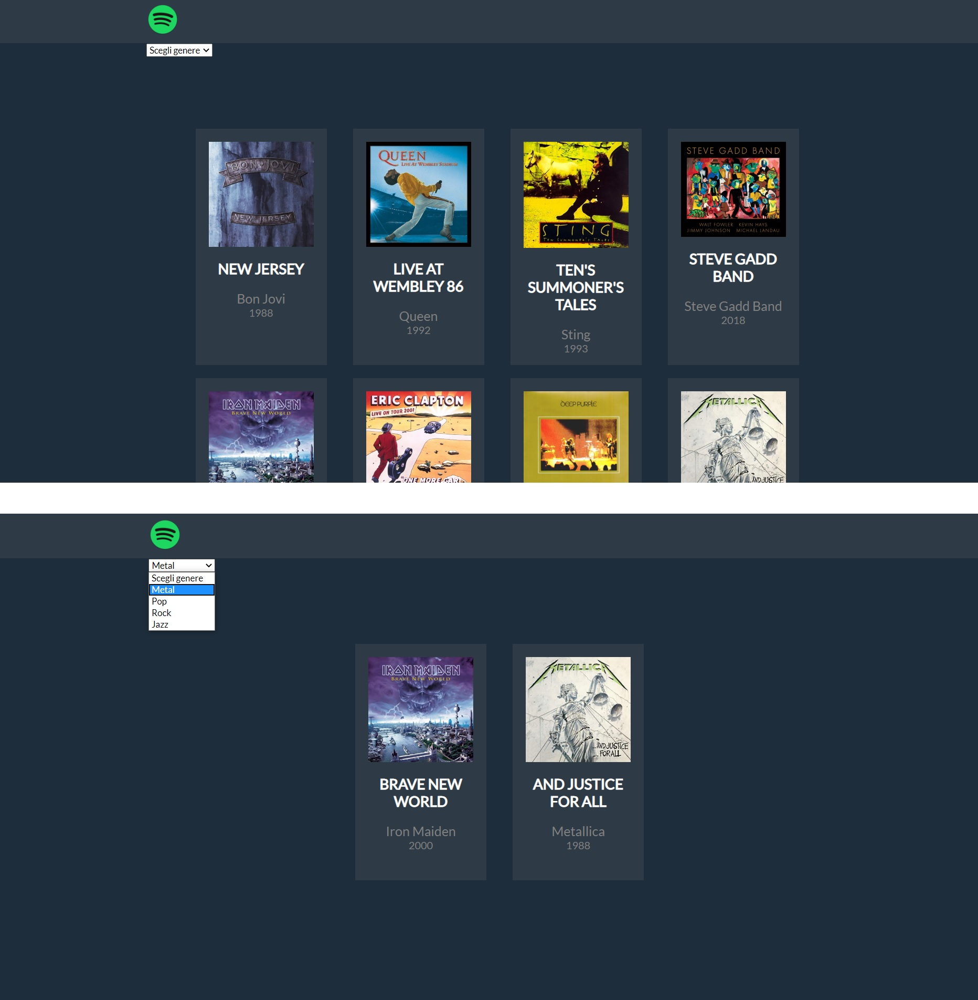

# Js-jq-ajax-api-musica
Thanks to an AJAX request I get informations of different songs, then I show them on the page by using handlebars.  
There is also a select to filter the songs by genre.
***
### [Live Website](https://gianluigivitale.github.io/js-jq-ajax-api-musica/)
***
### Preview:
Ajax request:  
  

Preview:  

